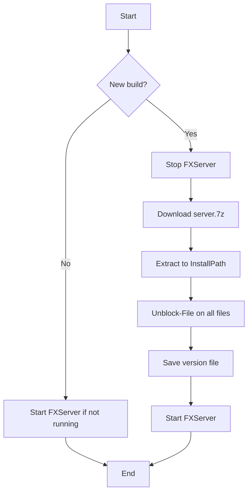

# FiveM Server Artifact Updater

PowerShell toolkit for Windows that automatically downloads, installs, and starts [FiveM server artifacts](https://runtime.fivem.net/artifacts/fivem/build_server_windows/master/) — no manual browser downloads required.

Ideal for dedicated Windows servers that need FXServer kept up to date and started automatically after a reboot.

## Features

- Downloads `server.7z` from the official FiveM artifact page
- Selects builds via channel: **Latest**, **Recommended**, or **Optional**
- Extracts to any folder (e.g. your FXServer/txAdmin installation)
- Removes Windows blocking (*Mark of the Web*) with `Unblock-File`
- Stops running `FXServer.exe` before updating (configurable)
- Starts the server with your chosen `serverProfile`
- Can register as a scheduled task on **Windows startup**
- Downloads portable `7zr.exe` automatically if 7-Zip is not installed
- Logs to `logs/`

## Requirements

| Requirement | Description |
|-------------|-------------|
| **OS** | Windows Server or Windows 10/11 |
| **PowerShell** | 5.1 or later |
| **Network** | Outbound HTTPS to `runtime.fivem.net` (and `7-zip.org` on first run) |
| **Permissions** | Administrator for startup task; write access to install folder |
| **7-Zip** | *Optional* — if missing, `tools\7zr.exe` is downloaded automatically |

## File structure

```
scripts/
├── Update-FiveMServer.ps1       # Main script
├── fivem-updater.config.json    # Configuration
├── Install-FiveMStartupTask.ps1 # Registers boot task (Latest)
├── Start-FiveMServer.bat        # Simple manual start
├── README.md
├── cache/                       # Downloaded .7z (created automatically)
├── logs/                        # Log files (created automatically)
└── tools/
    └── 7zr.exe                  # Downloaded when needed
```

After installation, the current version is stored in:

```
<InstallPath>\.fivem-artifact-version
```

## Quick install

### 1. Clone or copy the folder

```powershell
git clone <your-repo-url> C:\Server\scripts
cd C:\Server\scripts
```

Or copy the entire `scripts` folder to your preferred location, e.g. `C:\Server\scripts`.

### 2. Configure

Edit `fivem-updater.config.json`:

```json
{
  "ArtifactBaseUrl": "https://runtime.fivem.net/artifacts/fivem/build_server_windows/master",
  "Channel": "Recommended",
  "InstallPath": "C:\\Server\\TXAdmin",
  "ServerProfile": "YourServerProfile",
  "TxAdminPort": null,
  "ExtraFxServerArgs": "",
  "CachePath": "C:\\Server\\scripts\\cache",
  "LogPath": "C:\\Server\\scripts\\logs",
  "StartupDelaySeconds": 120,
  "CheckOnlyOnStartup": true,
  "StartServerAfterUpdate": true,
  "UnblockFiles": true,
  "StopRunningServerBeforeUpdate": true
}
```

| Setting | Description |
|---------|-------------|
| `Channel` | Default for manual runs: `Recommended`, `Latest`, or `Optional` |
| `InstallPath` | Folder where `FXServer.exe` lives (artifacts are extracted here) |
| `ServerProfile` | txAdmin/server profile, e.g. `+set serverProfile "..."` |
| `TxAdminPort` | Set to a port number if using txAdmin, otherwise `null` |
| `ExtraFxServerArgs` | Extra FXServer arguments, e.g. `+set onesync on` |
| `StartupDelaySeconds` | Seconds to wait after boot before the script runs |
| `CheckOnlyOnStartup` | `true` = only download when a new build is available |
| `StartServerAfterUpdate` | Start FXServer after a successful update |
| `UnblockFiles` | Run `Unblock-File` on all files in the install folder |
| `StopRunningServerBeforeUpdate` | Stop running FXServer before updating |

> **Important:** `InstallPath` must point to your **FXServer runtime** (where `FXServer.exe` is), not necessarily your `resources` or `server.cfg` folder. Resources usually live separately under e.g. `txData`.

### 3. Allow script execution (if needed)

```powershell
Set-ExecutionPolicy -ExecutionPolicy RemoteSigned -Scope CurrentUser
```

### 4. Test manually

```powershell
cd C:\Server\scripts
.\Update-FiveMServer.ps1 -Channel Latest -StartServer
```

The first run may take a few minutes (~50–60 MB download + extraction).

### 5. Automatic start on Windows boot (optional)

Open **PowerShell as Administrator**:

```powershell
cd C:\Server\scripts
.\Install-FiveMStartupTask.ps1
```

This creates the scheduled task `FiveM_Server_AutoUpdate_Start` which:

- Runs as **SYSTEM** with highest privileges
- Triggers **at system startup**
- Waits **120 seconds** (allows network to come up)
- Always uses the **Latest** channel (newest build on master)
- Starts the server with `-StartServer`

## Artifact channels

FiveM publishes several build types on the [master branch](https://runtime.fivem.net/artifacts/fivem/build_server_windows/master/):

| Channel | Description | Recommendation |
|---------|-------------|----------------|
| **Latest** | Highest build number in the list | Newest features; may be less tested |
| **Recommended** | Marked *LATEST RECOMMENDED* | Best for stable production |
| **Optional** | Marked *LATEST OPTIONAL* | Alternative/experimental line |

The **startup task** (`Install-FiveMStartupTask.ps1`) always uses **Latest**. Manual runs follow `Channel` in config unless you pass `-Channel` on the command line.

## Usage

### Update and start

```powershell
.\Update-FiveMServer.ps1 -StartServer
```

### Force reinstall of the same version

```powershell
.\Update-FiveMServer.ps1 -Force -StartServer
```

### Specific channel

```powershell
.\Update-FiveMServer.ps1 -Channel Recommended -StartServer
.\Update-FiveMServer.ps1 -Channel Latest -StartServer
.\Update-FiveMServer.ps1 -Channel Optional -StartServer
```

### Update only (do not start)

```powershell
.\Update-FiveMServer.ps1 -Channel Latest
```

Set in config: `"StartServerAfterUpdate": false`

### Via batch file

Double-click or run:

```cmd
Start-FiveMServer.bat
```

Uses settings from `fivem-updater.config.json` and `-StartServer`.

### Startup task

| Action | Command |
|--------|---------|
| Install | `.\Install-FiveMStartupTask.ps1` (requires admin) |
| Remove | `.\Update-FiveMServer.ps1 -RemoveStartupTask` |
| View in Task Scheduler | `taskschd.msc` → `FiveM_Server_AutoUpdate_Start` |

Verify registration:

```powershell
schtasks /Query /TN "FiveM_Server_AutoUpdate_Start" /V /FO LIST
```

## How the update works



1. Fetches HTML from the artifact page and resolves the correct build folder (`<number>-<git-hash>`).
2. Compares with `.fivem-artifact-version` in the install folder.
3. On a new version: downloads, extracts with 7-Zip, unblocks files.
4. Starts `FXServer.exe` with the configured profile.

## Logs and troubleshooting

Logs are saved daily:

```
logs/fivem-updater_YYYYMMDD.log
```

### Common issues

**`ExecutionPolicy` blocks the script**

```powershell
powershell -ExecutionPolicy Bypass -File ".\Update-FiveMServer.ps1" -StartServer
```

**Download fails**

- Check internet and firewall access to `runtime.fivem.net`
- On boot: increase `StartupDelaySeconds` if the network is slow

**7-Zip / extraction fails**

- Install [7-Zip](https://www.7-zip.org/) to the default location, or
- Delete `tools\7zr.exe` and run again (it will be re-downloaded)

**FXServer does not start**

- Verify `InstallPath` contains `FXServer.exe`
- Verify `ServerProfile` matches your txAdmin profile
- Start manually to see errors in the console:

```powershell
cd C:\Server\TXAdmin
.\FXServer.exe +set serverProfile "YourProfile"
```

**Windows still warns about the exe**

`Unblock-File` removes *Blocked from internet*. SmartScreen may still require manual approval the first time. For servers, you can add exclusions in Windows Defender (optional, requires admin).

**Scheduled task does not run**

- Confirm the task exists and is *Ready* in Task Scheduler
- Ensure the machine is not shutting down before the task runs
- Read the log file after a reboot

## Security

- The script only downloads from official FiveM and 7-Zip URLs.
- The startup task runs as **LOCAL SYSTEM** — use only on trusted dedicated servers.
- Do **not** put sensitive data (license keys, passwords) in the config file if the repo is public.
- `cache/` and `logs/` should be in `.gitignore` (large files and server info).

## Adapting to your server

Example for a typical txAdmin setup:

| Component | Example path |
|-----------|--------------|
| FXServer (artifacts) | `C:\Server\TXAdmin` |
| Server data / resources | `C:\Server\txData\<profile>\` |
| server.cfg | `C:\Server\txData\QBCore\server.cfg` |

Artifacts only update the FXServer runtime. Your resources, `server.cfg`, and database are not affected by this script.

## License

Free to use and modify. FiveM and FXServer belong to their respective rights holders.

## Contributing

Pull requests and issue reports are welcome. Please test against a clean Windows install before submitting changes to artifact parsing or startup logic.
